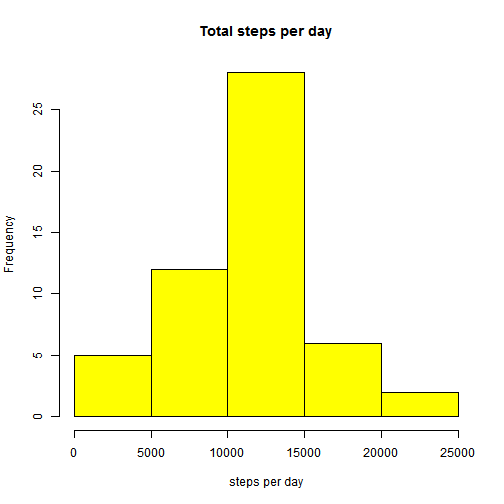
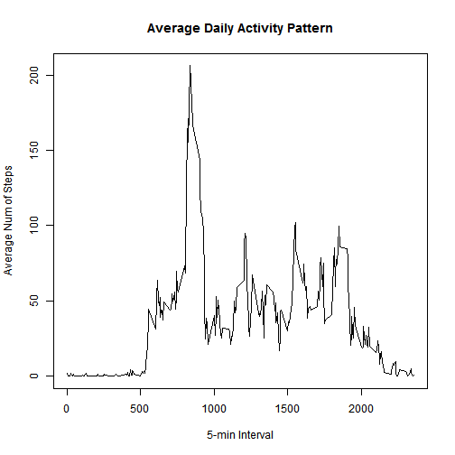
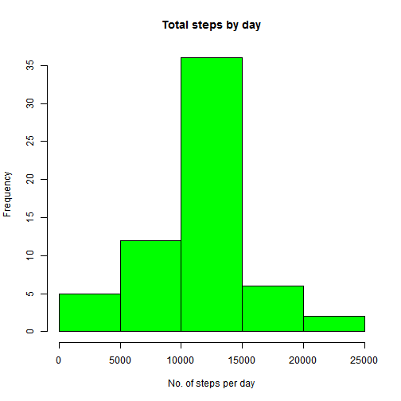
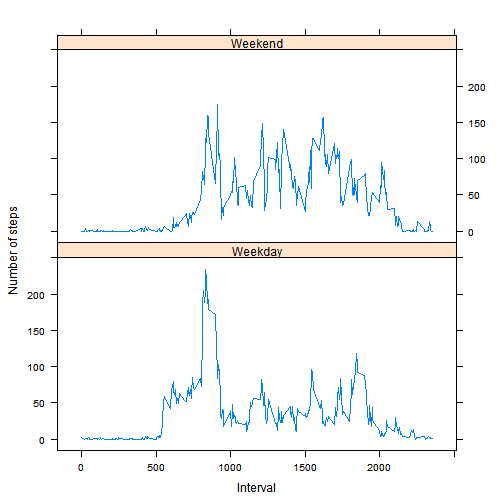

Loading and preprocessing the data


```r
activitydata <- read.csv("activity.csv", colClasses = c("numeric", "character", "numeric"), na.strings="Not Available")

head(activitydata)
```

```
##   steps       date interval
## 1    NA 2012-10-01        0
## 2    NA 2012-10-01        5
## 3    NA 2012-10-01       10
## 4    NA 2012-10-01       15
## 5    NA 2012-10-01       20
## 6    NA 2012-10-01       25
```

```r
activitydata$date <-as.Date(activitydata$date, format = '%Y-%m-%d')
```

What is mean total number of steps taken per day?


```r
## Calculate the total number of steps taken per day

stepsperday <- aggregate(steps ~ date, data = activitydata, sum, na.rm=TRUE)
head(stepsperday)
```

```
##         date steps
## 1 2012-10-02   126
## 2 2012-10-03 11352
## 3 2012-10-04 12116
## 4 2012-10-05 13294
## 5 2012-10-06 15420
## 6 2012-10-07 11015
```

```r
## plotting a histogram for the total number of steps taken each day

hist(stepsperday$steps, main = "Total steps per day", xlab = "steps per day", col = 'yellow')
```

 

```r
## Calculating the mean and median of the total number of steps taken per day

mean(stepsperday$steps)
```

```
## [1] 10766.19
```

```r
median(stepsperday$steps)
```

```
## [1] 10765
```

What is the average daily activity pattern?


```r
## Make a time series plot (i.e. type = "l") of the 5-minute interval (x-axis) and the average number of steps taken, averaged across all days (y-axis)

ts_data <- tapply(activitydata$steps, activitydata$interval, mean, na.rm = TRUE)

ts_data1 <- cbind.data.frame(interval = as.integer(names(ts_data)), meansteps = unname(ts_data))

plot(ts_data1$interval, ts_data1$meansteps, type = "l", xlab = "5-min Interval", ylab = "Average Num of Steps", main = "Average Daily Activity Pattern")
```

 

```r
## Which 5-minute interval, on average across all the days in the dataset, contains the maximum number of steps?

max_interval<- which.max(ts_data)

names(max_interval)
```

```
## [1] "835"
```

Imputing missing values


```r
## Calculate and report the total number of missing values in the dataset (i.e. the total number of rows with NAs)

missing_val_count <- sum(is.na(activitydata))

missing_val_count
```

```
## [1] 2304
```

```r
## Devise a strategy for filling in all of the missing values in the dataset. The strategy does not need to be sophisticated. For example, you could use the mean/median for that day, or the mean for that 5-minute interval, etc.

## using mean to replace missing values

usemean <- aggregate(steps ~ interval, data = activitydata, FUN = mean)

## Filling missingvalues

filling_NA <- numeric()
for (i in 1:nrow(activitydata)) {
    interimset <- activitydata[i, ]
    if (is.na(interimset$steps)) {
        steps <- subset(usemean, interval == interimset$interval)$steps
    } else {
        steps <- interimset$steps
    }
    filling_NA <- c(filling_NA, steps)
}

## Create a new dataset that is equal to the original dataset but with the missing data filled in.

new_activitydata <- activitydata

new_activitydata$steps <- filling_NA

summary(new_activitydata)
```

```
##      steps             date               interval     
##  Min.   :  0.00   Min.   :2012-10-01   Min.   :   0.0  
##  1st Qu.:  0.00   1st Qu.:2012-10-16   1st Qu.: 588.8  
##  Median :  0.00   Median :2012-10-31   Median :1177.5  
##  Mean   : 37.38   Mean   :2012-10-31   Mean   :1177.5  
##  3rd Qu.: 27.00   3rd Qu.:2012-11-15   3rd Qu.:1766.2  
##  Max.   :806.00   Max.   :2012-11-30   Max.   :2355.0
```

```r
## Check if any missing values still left

sum(is.na(new_activitydata$steps))
```

```
## [1] 0
```

```r
## Make a histogram of the total number of steps taken each day and Calculate and report the mean and median total number of steps taken per day. Do these values differ from the estimates from the first part of the assignment? What is the impact of imputing missing data on the estimates of the total daily number of steps?

steps_per_day_post_fill <- aggregate(steps ~ date, data= new_activitydata, sum)

hist(steps_per_day_post_fill$steps, main = "Total steps by day", xlab = "No. of steps per day", col = "green")
```

 

```r
## Find mean and Median post filling NA values

mean(steps_per_day_post_fill$steps)
```

```
## [1] 10766.19
```

```r
median(steps_per_day_post_fill$steps)
```

```
## [1] 10766.19
```

```r
## Post filling the NA values, there is no change in the m mean value, but the median changed slighty
```

Are there differences in activity patterns between weekdays and weekends?


```r
day <- weekdays(activitydata$date)
daytype <- vector()
for (i in 1:nrow(activitydata)) {
    if (day[i] == "Saturday") {
        daytype[i] <- "Weekend"
    } else if (day[i] == "Sunday") {
        daytype[i] <- "Weekend"
    } else {
        daytype[i] <- "Weekday"
    }
}

activitydata$daytype <- daytype

activitydata$daytype <- factor(activitydata$daytype)

stepsbyday <- aggregate(steps ~ interval + daytype, data = activitydata, mean)

names(stepsbyday) <- c("interval", "daytype", "steps")

xyplot(steps ~ interval | daytype, stepsbyday, type = "l", layout = c(1, 2),    xlab = "Interval", ylab = "Number of steps")
```

 

